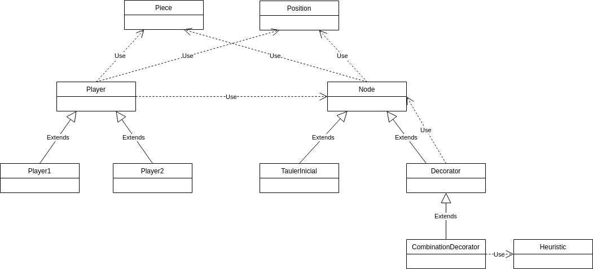

---
title: "Quarto - Intel·ligència Artificial"
author: [Marc Sànchez Pifarré, GEINF (UDG-EPS)]
date: 2019
subject: "Udg - Eps"
tags: [Quarto, IA]
subtitle: "Tutor de la pràctica : Llorenç Burgas Nadal"
titlepage: true
titlepage-color: 06386e
titlepage-text-color: FFFFFF
titlepage-rule-height: 4
...

# Introducció

En aquest informe s'explica com s'ha plantejat el desenvolupament de la pràctica així com els prunts crítics en el desenvolupament de la mateixa. L'informe està estructurat 4 parts, Algoritmes, Decorador, Jugador, Heurístic.

## Algoritmes

S'han desenvolupat els algoritmes MinIMax i AlfaBeta (veiem el codi dins del package Algortihms). En la pràctica només s'utilitza AlfaBeta ja que és una optimització de l'algoritme min i max. Tant l'algoritme Min i max com l'algoritme alfa beta incorporen el concepte de **poda heurística**.

Considerem que una branca de l'arbre pot ser objecte de poda quan un dels seus nodes és un node que es considera un node Fulla. (Funció isLeaf() de la classe Node). Un node es considera fulla si només si conté una combinació guanyadora o perdedora en l'estat al que representa.

S'ha plantejat realitzar la codificació de les classes com un patró strategy peró s'ha optat per optimitzar el funcionament de la pràctica i no afegir-hi complexitat innecessària.

## Patró decorador

Aquesta part de l'informe és la que considero de les més importants de tota la pràctica. En sí, la pràctica té una complexitat en nombre de càlculs molt elevada. Per cada torn (sobretot per els primers torns) intentar baixar a una certa profunditat és molt complicat degut a que per cada node hi ha 16! X 15! combinacions. Per aquest motiu desar el mínim d'informació en un node pot significar una gran ventatge en termes de memòria i en termes d'eficiència.

En aquest cas s'ha volgut representar tot el problema mitjançant el patro decorador, utilitzant com a nucli del decorador un tauler buit i decorant-lo amb les jugades. D'aquesta manera generar tot l'arbre és molt menys costós ja que només cal clonar els conjunts de peces i posicions disponibles i el canvi que es proposa. Per tant cada node només desa la modificació.

Llavors al preguntar per si un node és una fulla només ha de recorrer les referències aniuades del mateix decorador per assebenar-se'n igual que per realitzar el càlcul heurístic, fent la crida recursiva en tinc suficient per poder retornar un valor en funció d'un estat.

Aquesta composició em permet explorar la totalitat de l'arbre a partir de la tirada 8 i explorar fins al nivell 4 anteriorment.

### Diagrama de classes.

## Jugador

Juagdor s'ha plantejat com una classe pare que conté el tauler i el node arrel. També és qui posseeix el mètode tirada que reb del tauler.

S'ha fet com a classe pare per que cada jugador 1 o 2 pot tenir una manera una profunditat diferent per explorar. Pot donar-se el cas que el jugador 2 tingui un pèl més d'aventatge que el jugador 1 en l'exploració de la profunditat o viceversa. En el meu cas el jugador 2 pot explorar un xic més que el jugador 1 degut a com s'ha plantejat la pràctica. El jugador 2 pot explorar fins al nivell 5 en el torn 7 mentre que el jugador 1 només pot explorar fins el 4. (Depenent dels valors i de la poda que realitzi l'alfabeta pot ser que en l'exploració de 5 nivells trigui un temps un pél indecent peró la majoria dels casos son uns entre 15 i 20 segons).

## Heurísitc.

En realitat ha sigut el que he tingut més clar des del principi.

El que faig és contar el nombre de propietats coincidents en funció de les peces jugades per cada fila, columna i diagonal. Està en la classe Heuristic representat con un vector d'HeuristicRow. Cada HeuristicRow conté un nombre de 0s, un nombre de 1s, de 2s i de 4s que son els que s'utilitzen per ponderar la importància del node en qüestió. Cal destacar que els 3s son nodes que no volem ni veure! Son el dimoni! els 3's ens porten per el camí de l'amargura! Per aquest motiu no es contabilitzen.

Per tant si en una fila hi ha 2 peces rodones i amb punt que una és blanca i l'altre negra i una és gran i l'altre petita el valor referent a aquesta fila es representa amb un enter de 8 dígits de la següent manera:

- 1r dígit : blanques
- 2n dígit : negres
- 3r dígit : rodones
- 4t dígit : quadrades
- 5é dígit : sense forat
- 6é dígit : amb forat
- 7é dígit : petites
- 8é dígit : grans

Per tant la fila que conté dues peces esmentades anteriorment com *rodones i amb punt que una és blanca i l'altre negra i una és gran i l'altre petita* donaria com a resultat :

    11200211

On tindriem una blanca, una negre, dues rodones, cap quadrada, cap sense forat, dues amb forat i una gran i una altre de petita. Així realitzant els corresponents mòduls podemdetectar en tot moment si una fila conté 4 d'una mateixa propietat i per tant és una fulla.

### Sèrie de fibonacci

S'utilitzen els números del [3, 6] de la série de fibonacci referents als 2,3,5,8 per poder puntuar els resultats obtinguts. El càlcul del valor heurístic per cada fila columna i diagonal és : #zeros * 2 + #ones * 3 + #twos * 5 + #fours * 8. I fent el sumatori per totes les files, columnes i diagonals d'aquest valor és com obtenim un nombre que ens permet quantificar el valor de l'estat.

Per acabar de rematar l'heurísitc com més aviat pugui trobar la combinació de 4's millor i per tant multiplicaré per (16 - step) el valor de l'heurístic en cas que sigui una combinació guanyadora. Així el valor serà més alt si el node guanyador està més proper.  

Un cop tenim aquest valor qualtificat el següent pas és valorar si la tirada em pot beneficiar a mi o pot prevenir que el company em guanyi (valor min o valor max). En cas que el node sigui maximitzat, és a dir que sigui un node min aquest valor es retornarà tal qual s'ha explicat anteriorment, per altre banda si el node ha de ser minimitzat, és a dir que és un node max, aquest node retornarà el mateix valor de l'heurístic proposat anteriorment multiplicat per -1. D'aquesta manera el que anteriorment era més beneficiós per mi, ara és el pitjor per ell.

# Conclusió

La veritat és que m'ho he passat molt bé codificant el Quarto d'aquesta manera, m'hauria agradat seguir però les obligacions de les altres assignatures provoquen que no hi pugui invertir més temps. Tal com s'especifica a l'enunciat he intentat explicar com s'ha implementat tot i com s'ha pensat en un "documento concís", en cas que es requereixi una profunda evaluació, al codi està tot degudament comentat i explicat.

Com a possible millora per futures pràctiques : Per a aquests tipus de pràctiques pot ser molt oportú l'ús d'un patró template per a la codificació del player per exemple.
